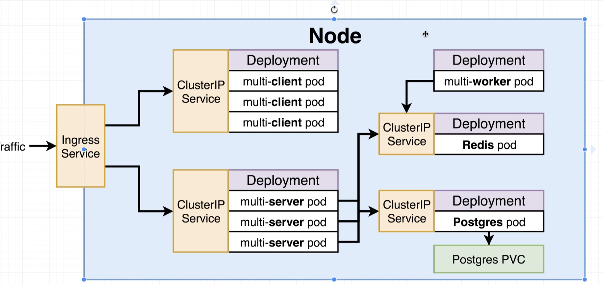

Using this repo for CI: 


## NodePort vs ClusterIP

### ClusterIP exposes a set of pods to other objects in cluster

### NodePort exposes a set of pods to the outside world (dev purpose)
- port : other pod needs multi cpient Pod
- targetPort: providing access to Pod
- nodePort: exposes to outside world


## Volume in K8S (not exactly docker volume)
An object that allows a container to store data at the pod level.

### Volume
stay inside Pod.
Data will gone on recreated, terminated but restart still stored data.
 
### Persistent Volume
Stay outside Pod, when pod is gone, Persistent volume strick around.

### PVC: Persistent volume claim
Make sure PVC have storage following configurations
- statically
- dynamically

### PVC Object
kind: PersistentVolumeClaim

accessModes
 - ReadWriteOnce -> can be used by a single node
 - ReadOnlyMany -> Multiple nodes can read from this
 - ReadWriteMany -> Can be read and written to by many nodes

resouces: requests: storage: 2Gi -> find storeafe instance and have 2 gigabytes
    

## create secret 
```
kubectl create secret generic(typeof secret) <secret_name> --from-literal key=value
```

## Nginx Ingress
using ingress-nginx from Github not kubernetes-ingress.
In this tutorial go to Local and Google Cloud.

## What the ingress-service ?


## GET ADMIN TOKEN
```
kubectl -n kubernetes-dashboard describe secret $(kubectl -n kubernetes-dashboard get secret | grep admin-user | awk '{print $1}')

```